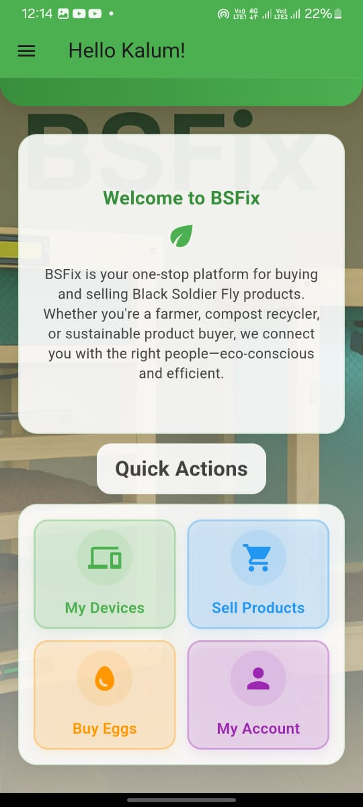
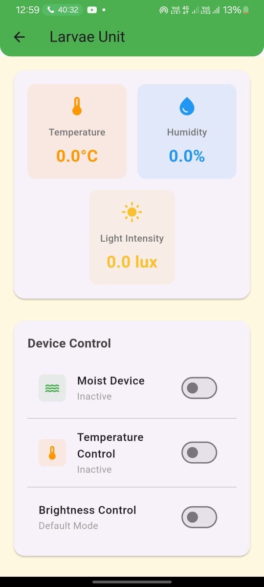
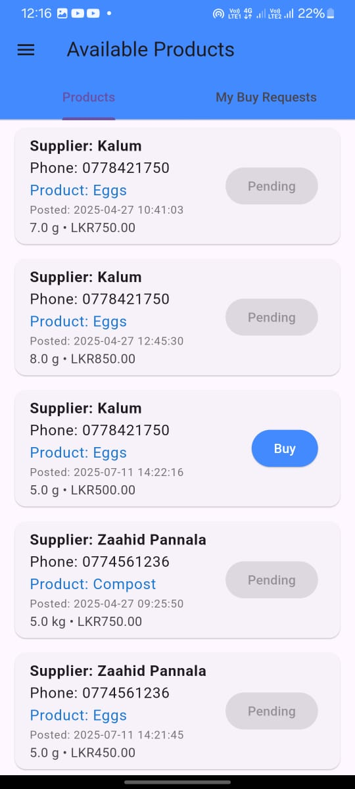

# Smart BSF Farming Mobile App

This repository contains the source code and development documentation for the **Smart BSF Farming Mobile App**, a critical part of our smart Black Soldier Fly (BSF) farming solution. This app empowers both suppliers and customers to register, monitor, control, and trade BSF-related products—making modern insect farming efficient and accessible.

---

## Table of Contents

- [About the Project](#about-the-project)
- [Features](#features)
- [System Overview](#system-overview)
- [Screenshots](#screenshots)
- [Getting Started](#getting-started)
- [Tech Stack](#tech-stack)
- [Team Contribution](#team-contribution)
- [Acknowledgements](#acknowledgements)

---

## About the Project

Our Smart BSF Farming Unit is divided into two sub-units:
- **BSF Larvae Breeding Unit:** For egg hatching, growth, and environmental monitoring.
- **Compost Making Unit:** For organic waste composting and bioproduct harvesting.

The mobile app allows users (customers and suppliers) to interact with these units, view live sensor data, control devices, and trade bio-products via a built-in marketplace.

---

## Features

### 🛠 Registration & Authentication
- Register breeding and compost units with unique IDs.
- User login with supplier or customer roles.

### 📈 Real-Time Unit Monitoring
- **Breeding Unit:** View live temperature, humidity, and light intensity.
- **Compost Unit:** Monitor compost levels and visualize larval distribution with thermal images.

### 🔧 Remote Controls
- Control moisture devices, set temperature targets, and adjust lighting (breeding unit).
- Retrieve compost via app controls (compost unit).

### 👁 Thermal Imaging
- Access visual thermal images of larvae to assess compost activity and larvae distribution (compost unit).

### 🛒 Marketplace Integration
- Suppliers can post and sell larvae or compost products.
- Customers can browse, buy, and order products directly.
- Supplier-to-supplier egg trading is supported.

### 🔑 User Management
- Separate dashboards for suppliers and customers to streamline operations.

---

## System Overview

<strong>How It Works</strong> (click to expand)

- **Unit Registration:** Add new breeding or compost units with unique IDs linked to your account.
- **Data Collection:** Environment and activity data are streamed from sensors in real time.
- **Device Control:** Directly send commands (e.g., change brightness, humidity) through secure APIs.
- **Marketplace:** Supplier posts products and customers place orders via an in-app e-commerce platform.
- **Role-based Access:** Features and navigation adapt to supplier or customer roles after login.

---

## Screenshots

<!-- Add or update these with links/renders from your actual app build -->

| Home Dashboard            | Environmental Controls      | Marketplace         |
|--------------------------|----------------------------|---------------------|
|  |    |  |

---

## Getting Started

1. **Clone the repository:**  
   `git clone https://github.com/yourusername/bsf-smart-farming-app.git`

2. **Install dependencies:**  
   `npm install` or `yarn install` (based on framework)

3. **Configure:**
    - Set up connections to IoT database, real-time APIs, and user authentication.
    - See `/docs/setup.md` for API keys and unit registration.

4. **Run:**  
   `npm start` or open in Android Studio/Xcode for mobile builds.

---

## Tech Stack

- **Frontend:** React Native (or Flutter) for seamless cross-platform support
- **Backend API:** Node.js/Firebase/AWS (update if different)
- **Real-Time Data:** MQTT/WebSockets for sensor/control data
- **Image Handling:** Integrated for thermal image display
- **Authentication:** Firebase Auth / JWT / Social logins (specify as implemented)
- **Marketplace:** In-app purchase flows and product listings

---

---

## Team Contribution

**Mobile App Developer**  
- Developed the complete mobile app to interface with the BSF breeding and compost units.
- Implemented:
    - Registration with unique unit IDs
    - Real-time monitoring (temperature, humidity, light, compost level)
    - Device control features (moisture, temperature, lighting, compost retrieval)
    - Thermal image integration for larvae analysis
    - Marketplace for product trading between suppliers and customers
    - Dual-role login (supplier & customer) with role-based UI/UX

Worked closely with backend/IoT developers and UI designers for seamless app-device and app-marketplace integration.

---

## Acknowledgements

Thanks to all team members for their collaboration and innovation, and to our advisors for their guidance.

---

